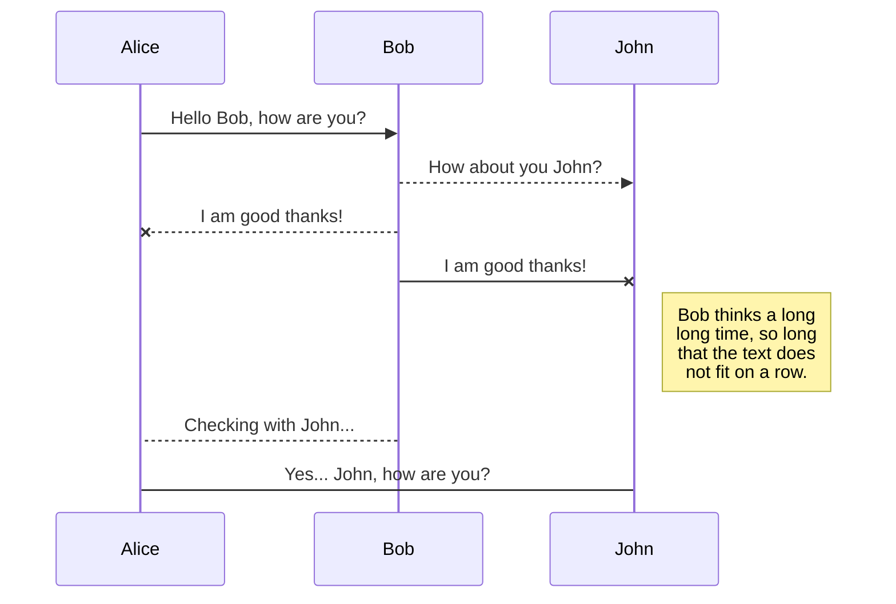
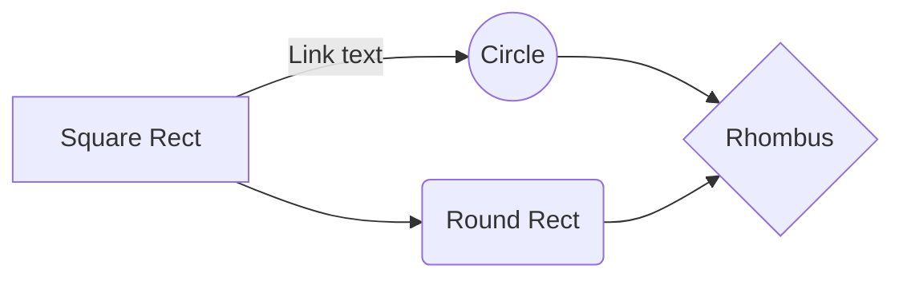

# FrontColombiApp

Documentacion del proyecto colombia opina, este documento recopila el acceso a erramientas usadas en el desarrollo de nuestra aplicacion web, que podiras encontrar encontrar en este documento?
acceso a Documentacion oficial de tegnologias enumeradas en el package.json, su modo de uso

# Files

StackEdit stores your files in your browser, which means all your files are automatically saved locally and are accessible **offline!**

## Create files and folders

The file explorer is accessible using the button in left corner of the navigation bar. You can create a new file by clicking the **New file** button in the file explorer. You can also create folders by clicking the **New folder** button.

## Switch to another links
https://mermaid.js.org/syntax/flowchart.html#circle-edge-example 
https://daisyui.com/docs/utilities/
https://daisyui.com/components/ 

## UML diagrams

You can render UML diagrams using [Mermaid](https://mermaidjs.github.io/). For example, this will produce a sequence diagram:

And this will produce a flow chart:

